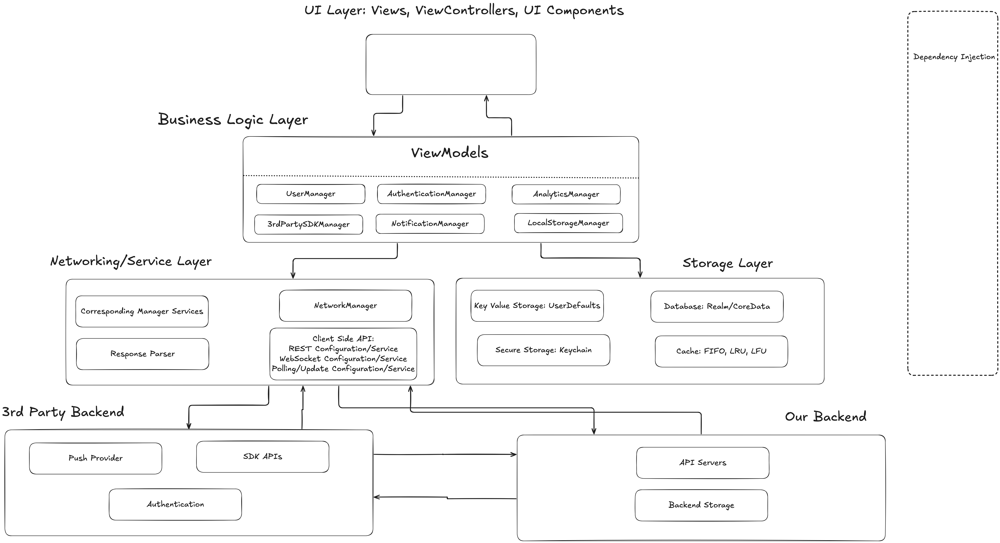

# Sytem Design

## General Questions

- How many users per day/per month/total?
- Where are users located?
  - CDN considerations
  - GDPR/CCPA or other privacy concerns
    - Do we need to handle sensitive data?
- What OS versions are we supporting?
  - I would do the latest 3 for iOS as that generally encompasses (95%)
  - Android 7 onward
  - Speeds up development time
- Cross platform support?
- Offline support?
  - What features are supported
- Push notification support?
  - If so what scenario?
- Localization?
- Deep Linking?
- Authentication?
- Accessibility?
- Analytics?
  - Remote Config
- Payment processing
- What is the team size? How many resources do we have?
  - More resources allows for modularization
- Network Types (Wifi or Cellular or Both)?

### Functional Requirements

- Can users discover content through browsing or searching? Are there any filtering options?
- Can users create and manage playlists or libraries?
- Can users interact with content, such as liking or sharing?

### Non-functional Requirements (Non feature related)

- Data should be highly available and reliable
- Analytics
- Privacy
- OS Support
- Security
- Battery performance
- Localization *
- Push Notifications *

### Music Streaming (e.g., Spotify, Apple Music)

- **REST + HTTP**:
  - **Endpoints**:
    - `GET /api/tracks` - List tracks.
    - `GET /api/albums` - List albums.
    - `GET /api/playlists` - List user playlists.

- **GraphQL + HTTP**:
  - **Use Case**: Allows querying for specific track details, user interactions, and recommendations. Supports personalized music suggestions and dynamic playlist updates.
  - **Query Example**:

    ```graphql
    {
      playlist(id: "123") {
        name
        tracks {
          title
          artist
          duration
        }
      }
    }
    ```

- **WebSocket**:
  - Use for real-time interactions, such as live lyrics or synchronized playback.
  - Example: Connect to `/ws/music/playlist-sync` for live playback updates.

- **gRPC**:
  - Use for streaming high-quality audio data with minimal latency.
  - Example service: `StreamAudio(AudioRequest) returns (AudioResponse)`

- **App-Side Storage:**
  - **Key-Value Storage**: Store playback quality settings and user preferences in UserDefaults.
  - **Database/ORM**: Use Core Data to manage cached music tracks, playlists, and user history.
  - **Secure Storage**: Securely store user credentials and subscription details in the Keychain.
  - **Cache**:
    - **LRU**: Cache recently played tracks for quick access.
    - **LFU**: Cache frequently played tracks.

- **Backend Storage:**
  - **NoSQL**: For managing user preferences, playlists, and track metadata.
  - **Dedicated Storage Systems**: For large-scale audio file storage and distribution.

- **Pagination:**
  - **Cursor-based**: Efficient for browsing music tracks, playlists, or albums in a continuous feed.

- **Real-Time Data and Updates:**
  - **WebSocket**: For real-time updates on live lyrics, synchronized playback, and collaborative playlists.
  - **SSE**: Stream updates on new music releases or personalized recommendations.
  - **HTTP Polling**: Rarely used due to the real-time requirements of streaming

## High Level Diagram


